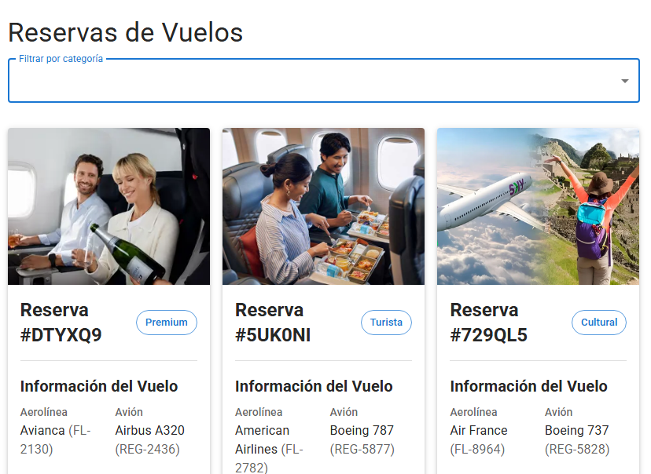
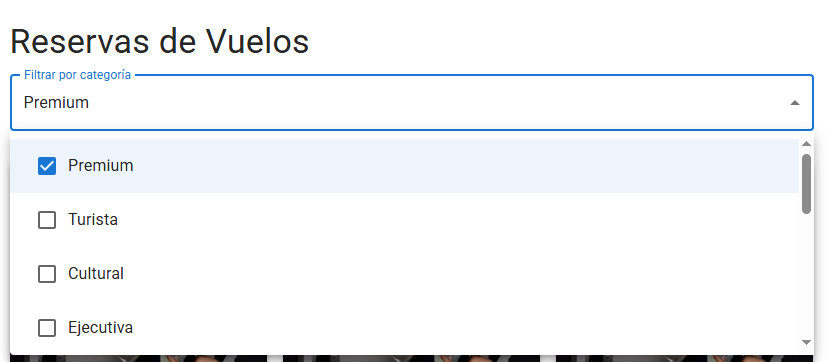
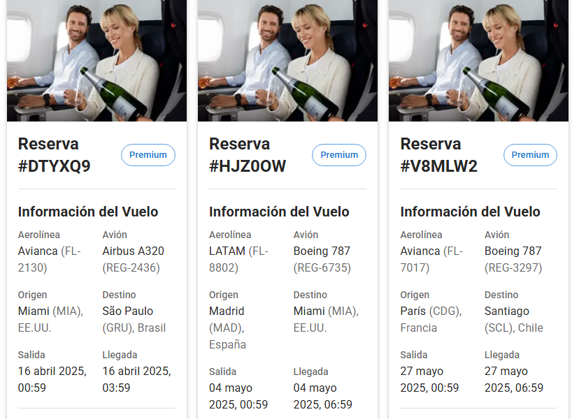
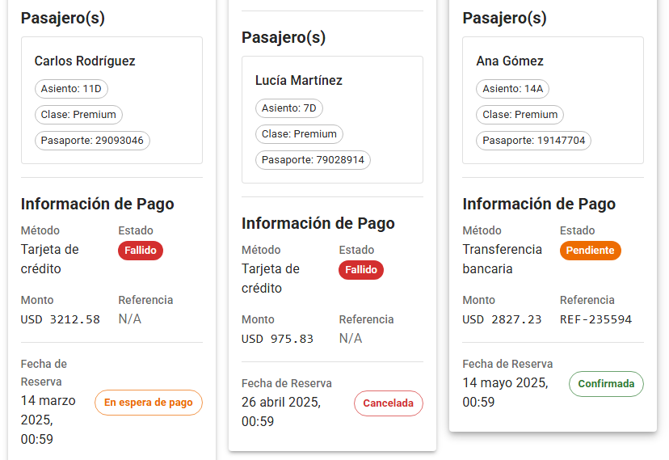

# 🛫 Filtro de Reservas de Vuelo

Aplicación React para gestionar y filtrar reservas de vuelo con interfaz intuitiva y capacidades avanzadas de filtrado.

## Vista Principal




---

# **Grupo "Testigos del Bitcoin**
Integrantes:
- Facundo Mentoro
- Eduardo Arizza
- Gonzalo Arizza
- Sandra Romero
- Martín Alejandro Lamas


---

## 🚀 Características principales

- **Filtrado avanzado** por múltiples categorías simultáneamente
- **Visualización detallada** de cada reserva con todos los datos relevantes
- **Diseño responsive** que funciona en cualquier dispositivo
- **Interfaz intuitiva** con Material-UI
- **Gestión de estados** de reserva y pagos
- **Formato profesional** de fechas y datos

## 🛠 Tecnologías utilizadas


---

## 🎨 Componentes principales

### `CardCountry.tsx`
Tarjeta detallada que muestra:
- Información completa del vuelo
- Datos de pasajeros
- Estado de pago
- Categoría de reserva
- Fechas formateadas profesionalmente

### `Filters.tsx`
Componente de filtrado con:
- Selección múltiple de categorías
- Chips visuales para selecciones
- Diseño adaptable

### `ListCardReservas.tsx`
Listado principal que:
- Gestiona el estado de los filtros
- Muestra las reservas filtradas
- Layout responsive en grid

## 🌟 Ejemplo de datos

```json
{
  "id": "RES-001",
  "categoria": "Premium",
  "vuelo": {
    "numero": "FL-2130",
    "origen": {
      "codigo": "MIA",
      "ciudad": "Miami",
      "pais": "EE.UU."
    },
    "destino": {
      "codigo": "GRU",
      "ciudad": "São Paulo",
      "pais": "Brasil"
    },
    "fechaSalida": "2025-04-16T00:59:13.063657",
    "fechaLlegada": "2025-04-16T03:59:13.063657",
    "avion": {
      "modelo": "Airbus A320",
      "capacidad": 283,
      "matricula": "REG-2436"
    },
    "aerolinea": "Avianca"
  },
  "pasajeros": [
    {
      "nombre": "Carlos Rodríguez",
      "tipoDocumento": "Pasaporte",
      "numeroDocumento": "29093046",
      "asiento": "11D",
      "clase": "Premium"
    }
  ],
  "pago": {
    "metodo": "Tarjeta de crédito",
    "numeroTarjeta": null,
    "referencia": null,
    "monto": 3212.58,
    "moneda": "USD",
    "estado": "Fallido"
  },
  "estado": "En espera de pago",
  "fechaReserva": "2025-03-14T00:59:13.063657",
  "codigoReserva": "DTYXQ9"
}
```

--- 


## **Capturas de Pantalla**
### Filtrar por Categoría


### Detalle de Reserva



### Detalle de Pasajero e Informacion de Pago



---